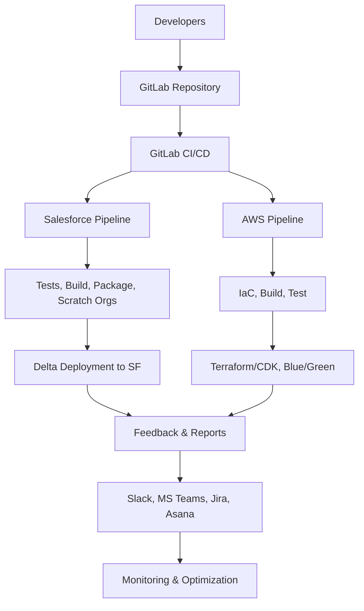

```mermaid
flowchart TD
    A[Developers] --> B[GitLab Repository]
    B --> C[GitLab CI/CD]
    
    C --> D[Salesforce Pipeline]
    C --> E[AWS Pipeline]
    
    D --> F[Tests, Build, Package, Scratch Orgs]
    F --> H[Delta Deployment to SF]
    
    E --> G[IaC, Build, Test]
    G --> I[Terraform/CDK, Blue/Green]
    
    H --> J[Feedback & Reports]
    I --> J
    
    J --> K[Slack, MS Teams, Jira, Asana]
    K --> L[Monitoring & Optimization]
```
